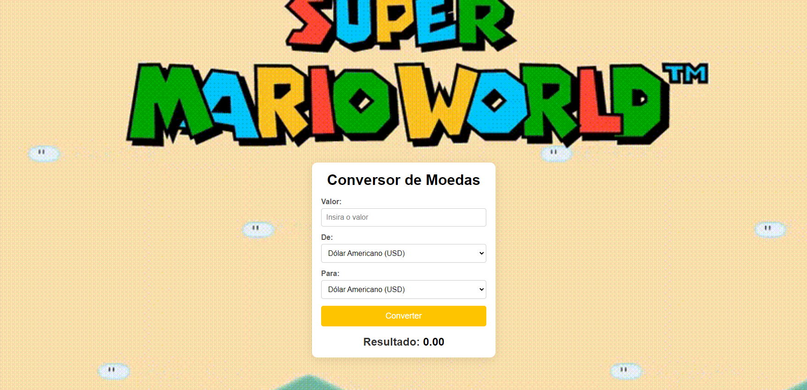

<h1 align="center">Conversor de Moedas - Super Mario Theme </h1>

---

## 💻 Sobre

Projeto feito no intuito de treinar meus conhecimentos.
## 🧠 Tecnologias utilizadas:

Eu utilizei as seguintes tecnologias:

    
    
    

---
<table>
  <tr>
    <td>
      
    </td>
    <td>
      Feito por <a href="https://github.com/David-Dev18">David Nathan.</a>
    </td>
  </tr>
</table>
